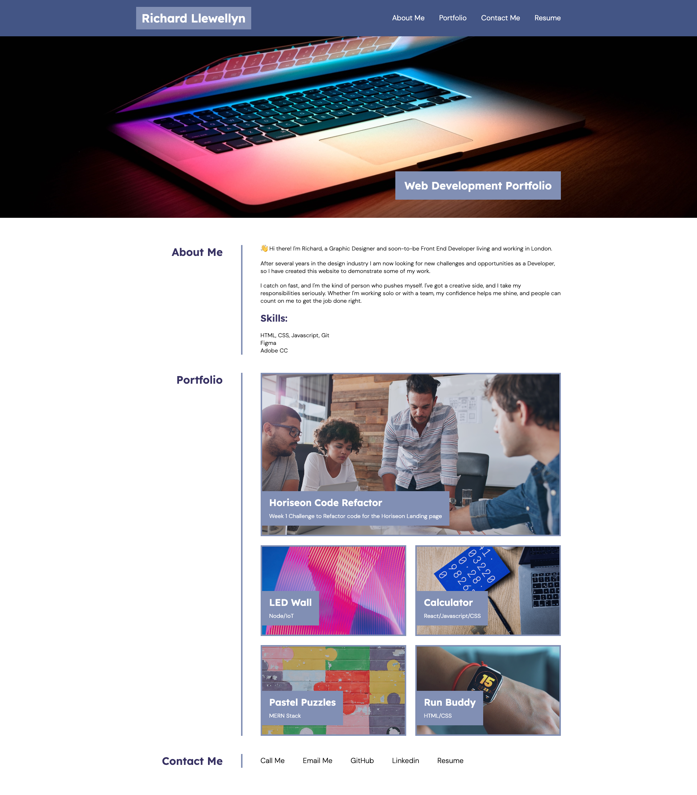

# richard-llewellyn-portfolio
Portfolio Challenge from Week 2 of EDX Bootcamp

<!-- TABLE OF CONTENTS -->

  
Table of Contents

  <ol>
    <li>
      <a href="#description">Description</a>
      <ul>
        <li><a href="#built-with">Built With</a></li>
      </ul>
    </li>
    <li>
        <a href="#installation">Installation</a>
    </li>
    <li><a href="#usage">Usage</a></li>
    <li><a href="#license">License</a></li>
    <li><a href="#contact">Contact</a></li>
    <li><a href="#acknowledgments">Acknowledgments</a></li>
  </ol>

<!-- ABOUT THE PROJECT -->
## Description

 
 
This was the second homework challenge for the EDX Bootcamp in Front End Development.
 

   
Our task was build a portfolio page using the skills we have learned so far in the bootcamp, such as Flexbox, Grid, css variables and media queries.

 

### Built With

* 
* 

## Installation

N/A

<!-- USAGE EXAMPLES -->
## Usage

To use this project, please open the website in Chrome and then use developer tools to view the website using the Device Toolbar, which is the icon of the Laptop and Phone next to the Element Selection tool in the top left corner of the window.

Once the device toolbar is open the user will be able to try out various devices such as iPhones and iPads in portrait and landscape views to see how the website responds on different screen sizes.

Alternatively uses can drag their browser window to resize the screen.

<!-- LICENSE -->
## License

Distributed under the MIT License. See `LICENSE.txt` for more information.

<!-- CONTACT -->
## Contact

Richard Llewellyn - richard.lee.llewellyn@gmail.com 

Project Link: [https://richllew182.github.io/richard-llewellyn-portfolio/](https://richllew182.github.io/richard-llewellyn-portfolio/)

Project Repo Link: [https://github.com/RichLlew182/richard-llewellyn-portfolio](https://github.com/RichLlew182/richard-llewellyn-portfolio)

<!-- ACKNOWLEDGMENTS -->
## Acknowledgments

* [Type Scale](https://typescale.com/)
* [Unsplash](https://unsplash.com/)
* [Img Shields](https://shields.io)
* [Best README Template](https://github.com/othneildrew/Best-README-Template)

